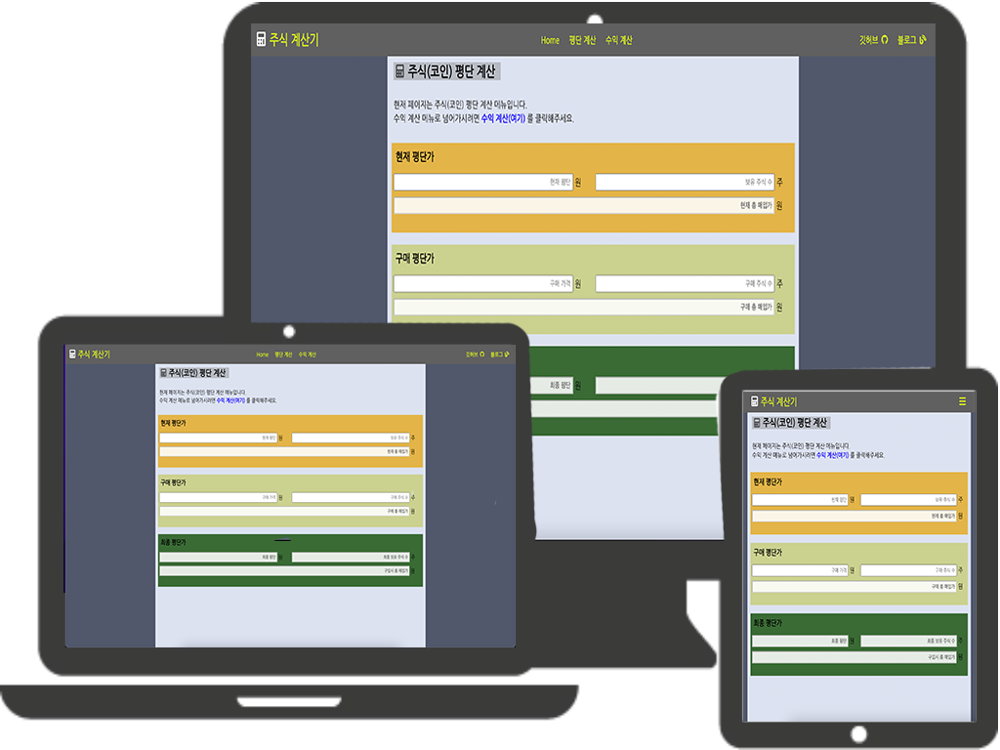

## [주식 계산기 0.01v](https://natube-frontend-portfolio.vercel.app/)

---

  

- 제가 좋아하는 주식 투자에 필요한 주식 계산기를 만들어봤습니다.
  아무것도 공부하지 않은 채 만들어 본 첫 번째 토이 프로젝트로써,
  오래 걸릴 시간이 아님에도 불구하고 우여곡절을 겪으면서 만들어봤습니다.

---

#### 1. 실행화면

###### 
[포트폴리오 홈페이지로 이동하기 ( 클릭! )](https://stock-calculator.vercel.app/stockavarage)

 

---

#### 2. 사용 기술 및 라이브러리

  

 

<!-- 라이브러리 -->

---

#### 3. 포트폴리오 설명

- ##### 3-1 . 평단 계산

  - 평단 계산은, 현재 매수된 평단가와 예상하는 매수 평단가를 계산해서
    최종 평단가를 계산합니다.  

  - 현재 평단가 계산은, 증권사에 나와있는 매수 평단 금액과, 보유 주식수를 입력하게 되면
    총 주식을 매수한 금액이 나오게 됩니다.
    ( 매수 평단 금액 \* 보유 주식 수 = 매수를 한 금액 )  

  - 구매 평단가 계산 또한, 현재 평단가 계산과 마찬가지로
    매수를 예상하는 호가와 주식 수를 입력하면, 매수에 필요한 총 금액이 나오게 됩니다.
    ( 매수 예상 호가 \* 예상 주식 수 = 매수에 필요한 금액 )  

  - 최종 평단가 계산은, 현재 평단가 및 구매 평단가를 모두 입력하게 되면
    예상되는 최종 평단가 및 최종 보유 주식수가 계산이 되고
    만약 구매 평단가만큼 매수를 하게 된다면 주식을 매수하기 위해 쓴 비용이 같이 계산됩니다. 
    ( 최종 매입가 / 최종 주식 수 = 최종 평단가 )
    ( 보유하고 있는 주식 수 + 매수 예상 주식 수 = 최종 주식 수 )
    ( 현재 매수를 한 금액 + 매수에 필요한 금액 = 최종 매수에 사용되는 금액 )

---

- ##### 3-2 . 수익 계산
  - 현재 가지고 있는 주식의 수와 평단가를 입력하고 매도 예상가를 입력하면 됩니다.
  - 해외 주식을 하시는 분들도 많기 때문에, 국내 주식과 해외 주식 수익금을 나눴습니다.
  - 변동되고 있는 환율을 서버에서 받아와 현재 환율에 대한 정보로 해외 주식 수익금을 계산합니다.
  - 또한 양도소득세 구간이라면, 양도소득세를 제외한 수익금까지 계산되어 보여지게 됩니다.  
    ( 양도 소득세 계산 방법 )
    - 수익금이 250만원이상이 될 경우가 조건이 된다.
    - 만약 예를 들어 1000만원의 수익을 얻었다면, 1000만원에서 250만원을 뺀 나머지
      750만원에 대한 이익만 양도소득세 22%를 부과하기 때문에
      ( 750만원 \* 0.22 = 165만원이 세금이 된다. )
    - 1000만원에서 165만원을 뺀 835만원이 최종 수익이 된다.
      물론 수수료나 이런 부분은 제외 된 값이다.

---

#### 4. 개발하고 싶은 기능 / 보완된 기능

##### 개발하고 싶은 기능들

- 계산 저장 기능
- 디자인 교체
- 주식 게시판 추가

##### 보완된 기능

- ~~달러 환율 계산~~
- ~~양도 소득세 게산~~

---

### 
포트폴리오에 대한 내용을 마치도록 하겠습니다.  모든 내용을 봐주셔서 감사합니다.

# 
Thank You!!

